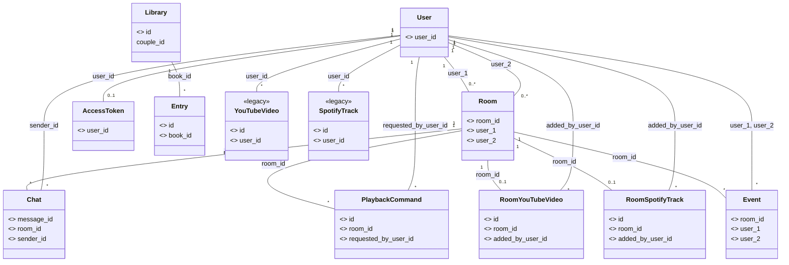
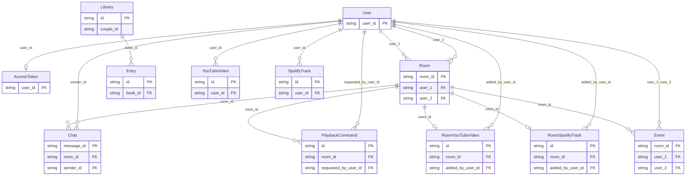

# Backend Models — UML Class Diagram

> Generated from `backend/src/models/`. Focus: primary keys, foreign keys, and entity relationships.

## Mermaid Class Diagram



## Entity-Relationship Diagram



## PK / FK Summary

| Entity | Primary Key | Foreign Keys |
|--------|-------------|--------------|
| User | user_id | — |
| Room | room_id | user_1 → User, user_2 → User |
| AccessToken | — | user_id → User |
| Library | id | — |
| Entry | id | book_id → Library |
| Event | — | room_id → Room, user_1 → User, user_2 → User |
| Chat | message_id | room_id → Room, sender_id → User |
| PlaybackCommand | id | room_id → Room, requested_by_user_id → User |
| RoomYouTubeVideo | id | room_id → Room, added_by_user_id → User |
| RoomSpotifyTrack | id | room_id → Room, added_by_user_id → User |
| YouTubeVideo (legacy) | id | user_id → User |
| SpotifyTrack (legacy) | id | user_id → User |

## Relationship Graph

```
                    ┌──────────┐
                    │   User   │
                    │ user_id  │
                    └────┬─────┘
         ┌───────────────┼───────────────┬───────────────┬───────────────┬──────────────┐
         │               │               │               │               │              │
         ▼               ▼               ▼               ▼               ▼              ▼
  ┌──────────────┐ ┌──────────┐  ┌──────────┐  ┌─────────────────┐ ┌─────────────────┐ ┌──────────┐
  │ AccessToken  │ │   Room   │  │   Chat   │  │ RoomYouTubeVideo │ │ RoomSpotifyTrack│ │  Event   │
  │  user_id    │ │ room_id  │  │msg_id   │  │       id         │ │       id        │ │ room_id  │
  └──────────────┘ │ user_1   │  │ room_id  │  │ room_id          │ │ room_id         │ │ user_1   │
                  │ user_2   │  │ sender_id│  │ added_by_user_id │ │ added_by_user_id│ │ user_2   │
                  └────┬─────┘  └──────────┘  └─────────────────┘ └─────────────────┘ └──────────┘
                       │
         ┌─────────────┼─────────────┐
         │             │             │
         ▼             ▼             ▼
  ┌──────────┐ ┌──────────────────┐ ┌──────────┐
  │   Chat   │ │ PlaybackCommand   │ │  Event   │
  │ room_id  │ │ room_id           │ │ room_id  │
  └──────────┘ │ requested_by_uid  │ └──────────┘
               └──────────────────┘

  ┌──────────┐       book_id        ┌──────────┐
  │ Library  │ ───────────────────▶│  Entry   │
  │    id    │                      │    id    │
  └──────────┘                      │ book_id  │
                                    └──────────┘
```
